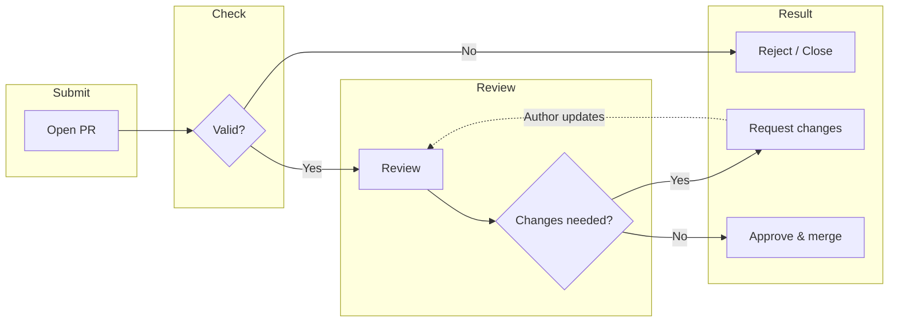

# Contributing to Deep Researcher

Thank you for considering contributing to **Deep Researcher**. This document explains how the project is structured, how to contribute, and the workflow we use to review and merge changes.

---

## Repository structure

Deep Researcher is split into two main parts. Contribute to the area that matches your change:

| Area | Path | Stack | When to contribute here |
|------|------|--------|--------------------------|
| **Frontend** | [`app/`](app/) | Electron, Vite, React 19, Tailwind, Shadcn | UI, workspaces, visualization, desktop behavior |
| **Backend** | [`backend/`](backend/) | Python 3.12+, FastAPI, Gemini, Ollama | APIs, research pipeline, storage, LLM integration |

- **Root** — Docs (e.g. `README.md`, `CONTRIBUTION.md`), repo-wide config, and high-level description.
- **App** — See [app/README.md](app/README.md) for setup and project layout.
- **Backend** — See [backend/README.md](backend/README.md) for setup and directory layout.

---

## Contribution workflow

We use a simple pull-request flow: open a PR → review → address feedback (if any) → merge once approved.

**In short:**

1. **Open a PR** — From a fork, against `main` (or the default branch).
2. **Valid?** — PR must match scope (see [Rules](#rules)), have a clear description, and not duplicate existing work. Invalid PRs may be closed or sent back with a short explanation.
3. **Review** — A maintainer (or reviewer) will review code and docs.
4. **Changes needed?** — If yes, we comment with feedback; you update the PR and we review again until everything looks good.
5. **Approve & merge** — When the review is satisfied, the PR is merged.

We do not run heavy internal systems (e.g. Kokoro or multi-stage internal pipelines). If we add CI later (e.g. lint or tests), the same idea applies: fix any failures, then we merge once review and checks pass.

---

## Rules

Follow these so your contribution can be merged quickly and stay consistent with the project.

### Before you start

- **Open an issue first** for anything non-trivial (feature, refactor, or breaking change). This helps align scope and avoid duplicate work.
- **One scope per PR** — One feature/fix per PR. Split large work into several PRs.
- **Branch from latest `main`** — Keep your branch up to date (rebase or merge `main` as needed).

### Code and structure

- **Match the area you change** — Frontend in `app/` (React/Electron conventions); backend in `backend/` (Python/FastAPI layout). See the READMEs in each folder.
- **Style** — Use existing style in that part of the repo (e.g. existing naming, formatting, and patterns). Run any project linters (e.g. `npm run lint` in `app/`, or backend equivalents if documented).
- **No unrelated edits** — Don’t mix formatting-only or refactor-only changes with behavior changes in the same PR unless agreed in an issue.

### Documentation and quality

- **Update docs** — If you change behavior, APIs, or setup, update the relevant README or doc (root, `app/`, or `backend/`).
- **Describe the PR** — Use the PR template (if any) or at least: what changed, why, and how to verify. Link the issue if one exists.
- **Keep history clear** — Prefer a small number of logical commits; we may ask you to squash before merge.

### Conduct

- **Be respectful** — No harassment or off-topic attacks. We aim for a constructive, inclusive environment.
- **Assume good intent** — Review feedback is about the code and the product, not about you personally.

---

## How to contribute

### Reporting bugs or suggesting features

- Use **GitHub Issues**.
- For bugs: describe what you did, what you expected, and what happened (screenshots or logs help).
- For features: describe the use case and, if you can, a rough approach so we can discuss before you code.

### Code or documentation changes

1. **Fork** the repo and clone your fork.
2. **Create a branch** (e.g. `fix/issue-123` or `feat/add-export-option`).
3. **Set up the project** — Follow [README.md](README.md) and the README in [app/](app/README.md) or [backend/](backend/README.md) depending on what you’re changing.
4. **Make your changes** and run any existing lint/tests.
5. **Commit** with clear messages and **open a PR** against the default branch.
6. **Respond to review** — Address comments and push updates until the PR is approved, then we’ll merge.

### Review expectations

- Maintainers will try to respond within a few days; iteration may take longer depending on availability.
- We may request changes more than once. You can push new commits to the same branch; no need to open a new PR unless we ask.

---

## Summary

- **Structure**: Frontend in `app/`, backend in `backend/`, docs at root; see each area’s README for details.
- **Flow**: Open PR → validity check → review → address feedback → approve & merge.
- **Rules**: One scope per PR, follow existing style and structure, update docs, be respectful.

Thank you for helping make Deep Researcher better.

— **pixelThreader & Team**
