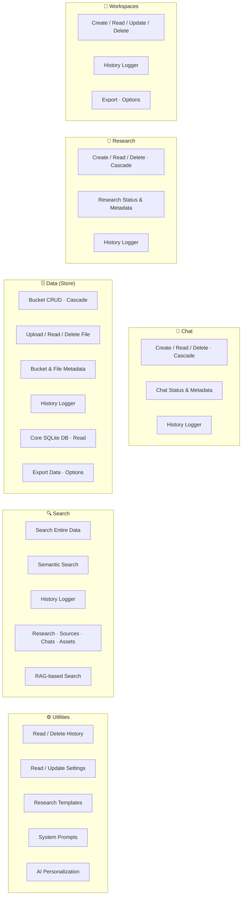

# Deep Researcher v2

**Version 2** — *Autonomously Synthesizing Global Knowledge*

<p align="center">
  
</p>

---

Deep Researcher is a state-of-the-art research platform that combines **Generative AI** with autonomous data gathering to deliver deep, evidence-based insights. Designed for professionals who need more than surface-level answers, it acts as an intelligent analyst: synthesizing information from the web, video, and structured sources into comprehensive, verifiable reports.

This is **Deep Researcher V2** — a major evolution from the original agent. The current version introduces multi-step reasoning, workspace-based organization, persistent storage with full auditability, and robust failure handling, replacing the earlier single-flow, file-only approach.

---

## System Overview

Deep Researcher runs as a **hybrid desktop application**: a native frontend for privacy and performance, backed by a dedicated research engine. The core architecture is organized around six capability domains:



- **Desktop app**: UI/UX, workspaces, real-time visualization, and user interaction.
- **Backend engine**: Orchestration, web/data ingestion, LLM inference, and persistent storage with logging and fallback handling.

---

## Features

- **Autonomous research agents** — Multi-step reasoning, browsing, and synthesis.
- **Chain-of-thought visualization** — Follow the agent’s logic and planning in real time.
- **Workspace-first design** — Organize work in dedicated workspaces with persistent context.
- **Structured artifacts & citations** — Findings and claims backed by citations for verifiability.
- **Database-backed storage** — Full logging, history, and fallback prevention (no “ghost” files).
- **Premium desktop experience** — Modern UI (React 19, Tailwind CSS 4, Framer Motion), cross-platform (Windows, macOS, Linux).

---

## Legacy: Deep Researcher V1

The previous generation ([**Legacy Deep Researcher V1**](https://github.com/pixelThreader/Deep-Researcher)) was a **simple reflex agent**: a single, predefined pipeline with minimal structure.

- **Single flow** — One fixed research pipeline; no multi-step orchestration.
- **File-only output** — All research stored in a single folder; no database or audit trail.
- **Basic discovery** — Title-based filter/search only.
- **Limited reliability** — No persistent logs, no fallback handling, and no guarantee that generated files were correctly recorded or recoverable.

V2 replaces this with workspaces, multi-step agents, database-backed storage, and robust file and log management. For the original codebase and releases, see the [legacy repository](https://github.com/pixelThreader/Deep-Researcher).

---

## Repository Structure

The project is split into two main components, each with its own setup and contribution guide:

| Component | Role | Documentation |
|-----------|------|----------------|
| **[`app/`](app/)** | Desktop shell: UI, workspaces, visualization | [Frontend README](app/README.md) |
| **[`backend/`](backend/)** | Research engine: APIs, crawlers, LLMs, storage | [Backend README](backend/README.md) |

### Frontend (`app/`)

- **Stack**: Electron, Vite, React 19, Tailwind CSS 4, Shadcn UI, Motion, Rive.
- **Responsibilities**: User interaction, workspace management, chain-of-thought and artifact visualization.

### Backend (`backend/`)

- **Stack**: Python 3.12+, FastAPI, Google Gemini, Ollama.
- **Responsibilities**: Task orchestration, web/data ingestion, LLM calls, database and file-bucket storage (with logging and fallbacks).

See the READMEs in `app/` and `backend/` for detailed structure, conventions, and development instructions.

---

## Quick Start

1. **Clone the repository**
   ```bash
   git clone https://github.com/pixelThreaderOfficial/Deep-Researcher.git
   cd Deep-Researcher
   ```

2. **Backend**  
   Follow the [Backend README](backend/README.md): set up `.env`, install dependencies with `uv`, and run the API (e.g. `uv run ./main.py`).

3. **Frontend**  
   Follow the [Frontend README](app/README.md): install Node dependencies in `app/`, configure `.env`, and run the desktop app (e.g. `npm run dev` in `app/`).

4. **Distribution**  
   Build installers from `app/`: `npm run dist:win`, `npm run dist:mac`, or `npm run dist:linux` (see [app/README.md](app/README.md)).

---

## Contributing

Contributions are welcome. Please open issues or pull requests in this repository. For component-specific guidelines, see [app/README.md](app/README.md) and [backend/README.md](backend/README.md).

---

*“The goal is not just to search, but to understand.”*  
— **pixelThreader & Team**
